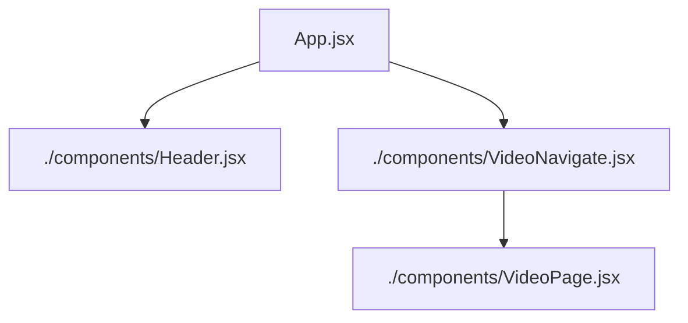

# Word guess game using React.js

### Instructions
- This is a word guess game
- Guess the word within 8 attempts
- With each wrong attempts one programming language is going to cut off, after 8 failed attempts Game is Over. 
- If you guess the word correctly within attempts limit, then you won. 
- Click on the button 'Play demo tutorial' to watch the video tutorial, and then you might close the video by clicking on 'Close Video X' button. 

## 🚀 Features

- Fully responsive layout for all screen sizes
- Component-based architecture
- Clean vanilla CSS styling
- Reusable custom React hook (useRefs, useEffect)
- Used React router for video playing in another jsx component
- Used navigate, when button is clicked navigate to another jsx component. 

## 🔗 Live Demo

 - Live vercel demo: [View Live Project](https://react-project-word-guessing-game-rg.vercel.app/)

## 🛠️ Tech Stacks

- React.js
- Vanilla CSS
- JavaScript ES6+

## 🎯 Key Learnings

### React Fundamentals
- JSX syntax and component structure
- Props for passing data between components
- State management with `useState`
- Event handling (mouse and touch events)
- React Hooks Basics (useEffect, useRefs)
- React router from 'react-router-dom' package
- useNavigate() from 'react-router-dom'

### CSS Skills
- Flexbox for flexible layouts
- CSS Grid for responsive structures
- Responsive design with media queries
- Mobile-first approach

## 📁 React-tree Structure

## 👤 Author

**[Abinash Dash]**

- GitHub: [@AbiDev2003](https://github.com/AbiDev2003)
---

⭐ Connect with me. Let's grow together !